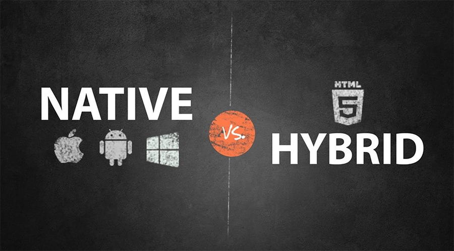
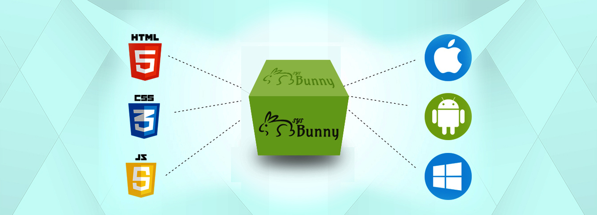
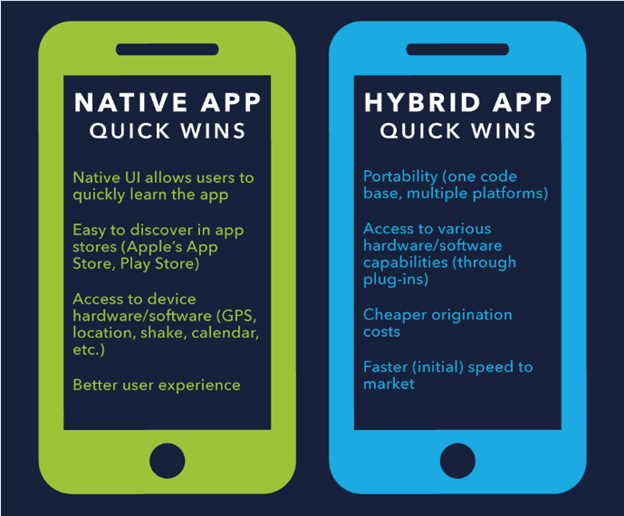

# Native and Hybrid Application Summary

---

## Native App

_A native mobile app is a smartphone application that is coded in a specific programming language. Native mobile apps provide fast performance and a high degree of reliability and can provide optimized performance and take advantage of the latest technology_

_Here're some of famous apps we use everyday and they all are native apps._

_So ever since there was even an App store to begin with, Native application development has been the standard in mobile. Native applications are written specifically for mobile operating systems such as iOS, Android and Windows._

_Now let's list the **pros** and **cons** of native development:_

#### Pros

- Due to all of the app’s elements being included in a single native package, native applications tend to have fast graphics with fluid animations built in.

- Native applications can access exclusive native APIs in the phone’s operating system such as push notifications, camera, and in-app purchases, which would otherwise be prohibited, or provided in a cumbersome manner on a mobile web application.

- Apple definitely wants to push their brand whenever possible, so they have provided UI components from their UI libraries to make development a little less painful.

#### Cons

- Native applications typically require designers to define phones and tablets separately, or define individual layouts. While this step is available and repeated on the web with CSS media queries, it’s usually a single layout and multiple style-sheets. The effort for native is non-transferable between iOS, Android and others since each operating system is locked into proprietary tooling.

- If you intend to also publish your app to a different app store, your application will need to be rewritten in order to be a native app on another mobile OS. This usually delays features for the next platform in development.

---

## Hybrid App

_Hybrid application development can do everything HTML5 does except it also has some features of Native applications. They do this by deploying a native harness or wrapper to act as a bridge between platforms and access native features. This wrapper can either be created manually or generated by a program._

_Also, here're lots of famous apps which are hybrid apps._

_A hybrid application is technically a web app packed in a native app container. Like the web app, it is written in HTML, CSS and JavaScript. Unlike the web app, it is distributed through the app store or Over-the-Air for iOS devices. Another difference is that the hybrid app is reliant on the WebView and not the mobile browser._

_Here're the **pros** and **cons** of hybrid development:_

#### Pros

- The content of a hybrid app is portable and just requires a native harness to run it.

- Since software like React provides frameworks to make a webpage act like a native application, they can be distributed on the App Store.

- Developers have the option to package the app locally or through a server, which provides access both online and offline.

- Hybrid apps are good for: Banks, news, media and content delivery platforms.

#### Cons

- Since hybrid applications are relatively new in the mobile development space, automatic generation may not work on all devices, which can get especially complicated when trying to accommodate to different Android phones.

- Phonegap, Cordova and others generate native by-products, meaning you still have to support and manage the individual packages in the app-stores. Keeping versions in sync across platforms while addressing individual bugs can be more difficult than a pure native approach.

- Lack of the pure UI assets of iOS or Android may result in a slower performance of the app in general. It may not look like a mobile website, but it may feel like it at certain points.

---

## Summary

_There is no absolute better, it depends on what is best for our situation. Weighing this with the pros and cons, native development sounds like the right choice. But we can see that a method that works for one app may not apply to another. Some may remain skeptical about hybrid development summed up by Java’s “Compile Once, Run Anywhere” phrase._
